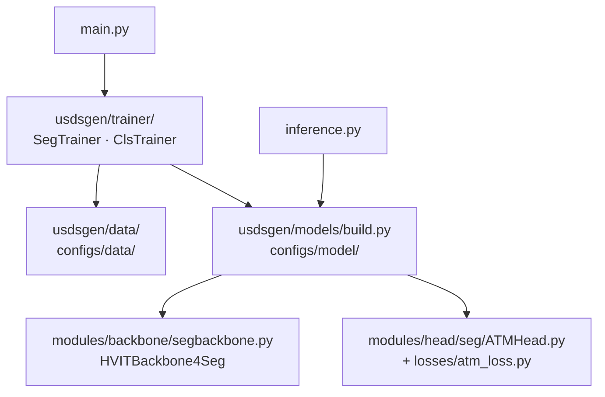

<div align="center">

# USFM — Ultrasound Foundation Model

**Muscle segmentation on ultrasound imagery, built on the USFM foundation model.**

<a href="https://pytorch.org/get-started/locally/"></a>
<a href="https://lightning.ai/docs/fabric/stable/"></a>
<a href="https://hydra.cc/"></a>

<a href="#license-and-citation"></a>

</div>

---

A fork of [openmedlab/USFM](https://github.com/openmedlab/USFM), restructured to run on
a current Python and PyTorch stack and extended for standalone inference.

The upstream project depends on `mmcv` and `mmsegmentation`, neither of which ship
wheels for Python 3.12+. Both have been removed: the model is now assembled from plain
`nn.Module` containers, which unblocks PyTorch 2.13 on Python 3.14 and removes the
transitive `openxlab`/`oss2` dependency chain that pinned `requests==2.28.2`.

| | Upstream | This fork |
|---|---|---|
| `mmcv` / `mmsegmentation` | Required | **Removed** |
| Python | 3.9 | **3.12+** (running 3.14) |
| PyTorch | 2.4.1 | **2.13** |
| Model assembly | `mmseg` registry (`EncoderDecoder`) | Plain `nn.Module` — [`usdsgen/models/build.py`](usdsgen/models/build.py) |
| Attention | Explicit matmul + softmax | `F.scaled_dot_product_attention` (Flash / mem-efficient) |
| Checkpoints | `best*.pth` only | Adds `last`, plus deployable and pretrain exports ([§5](#5-checkpoint-artifacts)) |
| Inference | — | Standalone [`inference.py`](inference.py) |

Weights from upstream remain fully compatible: the refactor preserves every
`state_dict` key, and the attention rewrite is numerically equivalent to within 1e-7.

---

## Contents

1. [Installation](#1-installation) · 2. [Pretrained weights](#2-pretrained-weights) ·
3. [Dataset layout](#3-dataset-layout) · 4. [Training](#4-training) ·
5. [Checkpoint artifacts](#5-checkpoint-artifacts) · 6. [Inference](#6-inference) ·
7. [Repository layout](#7-repository-layout) · 8. [Known limitations](#8-known-limitations)

---

## 1. Installation

```bash
git clone https://github.com/chauvinhtth13/USFM.git
cd USFM

conda create -n usfm python=3.12 -y
conda activate usfm

# Install PyTorch separately, matched to your CUDA version.
# See https://pytorch.org/get-started/locally/
pip install torch torchvision --index-url https://download.pytorch.org/whl/cu129

# Everything else. pyproject.toml is the source of truth for dependencies.
pip install -e .
```

No `mmcv` installation or `mmsegmentation` fork checkout is required.

`requirements.txt` lists verified minimum versions and exists for CI and environment
reproduction; it is not a second dependency declaration.

## 2. Pretrained weights

Download [`USFM_latest.pth`](https://drive.google.com/file/d/1KRwXZgYterH895Z8EpXpR1L1eSMMJo4q/view)
and place it at `./assets/FMweight/USFM_latest.pth`.

Training without pretrained weights is supported but emits a warning — the label
efficiency that motivates this model comes from the pretrained backbone.

## 3. Dataset layout

```
datasets/Seg/<dataset_name>/
├── training_set/
│   ├── image/
│   └── mask/
├── val_set/
│   ├── image/
│   └── mask/
└── test_set/
    ├── image/
    └── mask/
```

Masks are single-channel images where `0` is background and non-zero is foreground.
Each mask filename must match its corresponding image filename.

Register the dataset in `configs/data/Seg/<name>.yaml`; use
[`muscle.yaml`](configs/data/Seg/muscle.yaml) as a template. Paths resolve against
`data.dataset_path` (default `./datasets/`), so configs stay portable across machines.

A small dataset for smoke-testing the pipeline is available as
[`Seg_toy_dataset.tar.gz`](https://drive.google.com/file/d/1E3e7mTBdIxj4UOfeUrEFM6GgryXylodG/view)
(199 train / 50 val / 50 test).

## 4. Training

```bash
python main.py \
    experiment=task/Seg \
    data=Seg/muscle \
    data="{batch_size:8,num_workers:4}" \
    model=Seg/SegVit \
    model.model_cfg.backbone.pretrained=./assets/FMweight/USFM_latest.pth \
    train="{epochs:400,accumulation_steps:1}" \
    L="{devices:1}" \
    tag=muscle_r1
```

Classification (`experiment=task/Cls`, `model=Cls/vit`) uses the same entry point and
expects `ImageFolder`-structured data.

### Frequently used overrides

| Parameter | Effect |
|---|---|
| `L.devices` | GPU count (Fabric DDP) |
| `L.precision` | Default `bf16-mixed` |
| `train.compile` | Compile the backbone with `torch.compile` |
| `train.auto_resume` | Resume from the most recent checkpoint |
| `train.layer_decay` | Layer-wise LR decay (`0.65` for segmentation; `1.0` disables) |
| `model.model_cfg.backbone.use_checkpoint` | Gradient checkpointing — trades ~30% throughput for a large activation-memory reduction |
| `data.img_size` | Default `512` |

Outputs are written to
`logs/finetune/<task>/<dataset>/<model>/<tag>/<timestamp>/`, alongside TensorBoard
logs and per-validation metrics in `allsegmetrics.csv`.

## 5. Checkpoint artifacts

Each run produces three kinds of checkpoint, serving three distinct purposes:

```
best<epoch>.pth              # resumable training state
last<epoch>.pth              # resumable training state, final epoch
export/
├── best_deploy.pth          # self-describing, for inference
├── last_deploy.pth
└── last_pretrain.pth        # backbone only, for the next fine-tune
```

| Artifact | Contents | Use case |
|---|---|---|
| `best*.pth` / `last*.pth` | Model, optimizer, scheduler, config | Resume training, or `mode=test` |
| `export/*_deploy.pth` | Model, **architecture**, preprocessing parameters | Inference; sharing with downstream users |
| `export/last_pretrain.pth` | Backbone weights only | Initialising a fine-tune on a new dataset |

### Deploy checkpoints

A deploy checkpoint embeds its own `model_cfg` along with `img_size` and the
normalisation constants. Consumers do not declare the architecture, and cannot
silently mismatch preprocessing — a failure mode that degrades predictions without
raising an error.

```python
from usdsgen.models.build import load_deploy_checkpoint

model, meta = load_deploy_checkpoint("logs/.../export/best_deploy.pth", device="cuda")
# meta -> {'epoch': 80, 'dice': 0.971, 'img_size': 512, 'num_classes': 2,
#          'norm_mean': [...], 'norm_std': [...], 'dataset': 'muscle'}
```

These load under `torch.load(..., weights_only=True)`, so consuming one does not
require trusting a pickle.

### Continuing from a previous run

```bash
python main.py experiment=task/Seg data=Seg/<new_dataset> model=Seg/SegVit \
    model.model_cfg.backbone.pretrained=logs/.../export/last_pretrain.pth \
    tag=round2
```

The task head is deliberately excluded — it is tied to the class count of the
previous task.

## 6. Inference

```bash
python inference.py \
    --ckpt logs/.../export/best_deploy.pth \
    --input datasets/Seg/muscle/test_set/image \
    --output inference_out
```

Produces:

| Output | Contents |
|---|---|
| `mask/` | Binary masks at original image resolution |
| `overlay/` | Source image with the predicted region shaded and outlined |
| `panel/` | Side-by-side: source, prediction, GT comparison, confidence map |
| `report.csv` | Per-image statistics and metrics |

When ground-truth masks are found — either via `--mask-dir` or by substituting
`image/` with `mask/` in the input path — the script reports Dice, IoU, precision and
recall, aggregates them by data source, and lists the worst-scoring images.

Logits are interpolated to the original resolution *before* `argmax`, which is more
faithful than resizing the predicted mask.

Ordinary training checkpoints also work, but require `--img-size` to be passed
explicitly and to match the value used during training.

## 7. Repository layout



| Path | Responsibility |
|---|---|
| [`main.py`](main.py) | Hydra entry point; selects the trainer from `config.task` |
| [`usdsgen/trainer/`](usdsgen/trainer/) | Train / validate / test loops on Lightning Fabric |
| [`usdsgen/models/build.py`](usdsgen/models/build.py) | Assembles backbone and head; loads deploy checkpoints |
| [`usdsgen/data/`](usdsgen/data/) | Datasets and Albumentations transforms |
| [`usdsgen/utils/metrics.py`](usdsgen/utils/metrics.py) | Dice, IoU, HD95 (via MONAI) |
| [`usdsgen/utils/modelutils.py`](usdsgen/utils/modelutils.py) | Checkpoint export and pretrained-weight remapping |
| [`configs/`](configs/) | Hydra configs, grouped as `data` / `model` / `experiment` |

## 8. Known limitations

- **Only `SegVit` is supported.** The `Upernet` configuration was removed along with
  `mmsegmentation`, since `UPerHead` and `FCNHead` are mmseg components.
- **HD95 is not comparable to the upstream baseline.** It is now computed by MONAI
  (95th-percentile Hausdorff, Euclidean) rather than the unmaintained `hausdorff`
  package (raw Hausdorff, Manhattan). The change is deliberate and clinically more
  standard, but the numbers are on a different scale.
- **`train.layer_decay` now takes effect for segmentation.** It was previously
  ignored: the config specified `0.65`, but `build_optimizer` only applied layer-wise
  decay when `model_cfg.type` was `swin` or `vit`, while segmentation declares
  `EncoderDecoder`. Results will differ from runs made before this fix; pass
  `train.layer_decay=1.0` to reproduce the earlier behaviour.
- **The FPN uses `nn.SyncBatchNorm` unconditionally**
  ([`segbackbone.py`](usdsgen/modules/backbone/segbackbone.py)). This is correct under
  DDP and falls back to standard behaviour on a single device, but it is not
  configurable and can cause graph breaks under `torch.compile`.
- **No automated test suite.** CI runs import and forward-pass smoke tests only.

## License and citation

This project inherits the CC-BY-NC 4.0 license from upstream.

```bibtex
@article{JIAO2024103202,
  title   = {USFM: A universal ultrasound foundation model generalized to tasks and organs towards label efficient image analysis},
  journal = {Medical Image Analysis},
  volume  = {96},
  pages   = {103202},
  year    = {2024},
  doi     = {10.1016/j.media.2024.103202},
  author  = {Jing Jiao and Jin Zhou and Xiaokang Li and others and Yuanyuan Wang and Yi Guo},
}
```

Built on [transformers](https://github.com/huggingface/transformers),
[timm](https://github.com/huggingface/pytorch-image-models), and
[lightning-hydra-template](https://github.com/ashleve/lightning-hydra-template).
